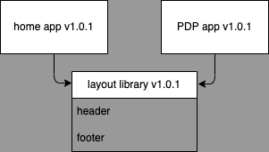
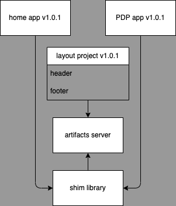
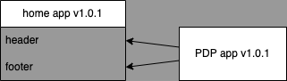
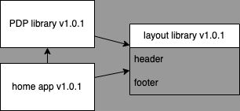

# webpack-module-federation

Exploring module federation in webpack. [Check out this video](https://www.youtube.com/watch?v=lKKsjpH09dU).

## todos

1. create two react webpack apps: home and pdp
1. export (default export) a header component from the home app
1. export a footer component from the home app 
1. add header and footer to home App
1. setup the mod fed plugin in the webpack config
1. add the header and footer to plugins[mod-fed-plugin: {exposes: {}}], key in the obj is the name of the exposed module and then value is the path to the module
1. restart webpack
1. setup webpack with the mod fed plugin in pdp
1. add entry to the mod fed remotes config: `home: "home@http://localhost:3000/remoteEntry.js`, where home is the name specified in the mod fed plugin in the home app
1. restart the pdp server
1. add header and footer to pdp App.tsx using `home/Header` as the import path

should now have a runtime connection between the two apps

## why module federation

Webpack 5+ supports module federation.

It can be applied to many frontend frameworks.

### NPM architecture

publishing changes

1. in the layout library:
   1. make the change
   2. bump the patch version
   3. publish to the package repository
2. in the home app:
   1. update the layout library dependency
   2. bump the patch version
   3. publish

> At this point the home app and the PDP app are using different headers.

3. in the PDP app:
   1. update the layout library dependency
   2. bump the patch version
   3. publish



### Asset store architecture

setup

1. in the shim library:
   1. fetch the layout artifacts from the artifact server
2. in the home and PDP app:
   1. add the shim library as a dependency
   2. inject the respective layout into the page

publishing changes

1. in the layout project:
   1. make the change
   2. bump the patch version
   3. pack to native JS, HTML and css
   4. publish to the artifacts server



### Module Federation architecture

publishing changes

1. in the home app:
   1. make the change
   2. bump the patch version
   3. publish



### Monorepo architecture

setup

1. in the PDP library:
   1. add the layout library as a dependency
   2. use the layout respectively
2. in the home app:
   1. add the layout library as a dependency
   1. add the PDP library as a dependency
   2. use both libraries respectively

publishing changes

1. in the layout library:
   1. make the change
   2. bump the patch version
2. in the home app:
   1. pack the home app and its dependencies to native JS, HTML and css
   2. publish



## home package

A simple package for the home page of a hypothetical application.

Uses babel to transpile the TS and compile the code over ts-loader.

## Gotchas

- [uncaught-error-shared-module-is-not-available-for-eager-consumption](https://webpack.js.org/concepts/module-federation/#uncaught-error-shared-module-is-not-available-for-eager-consumption)
- im getting this error in a component module without an import and just an export of the component function

```text
'React' refers to a UMD global, but the current file is a module. Consider adding an import instead.ts(2686)
```

- got this on first try of exposing the header and footer from the home package

```text
Module not found: Error: Can't resolve './scr/Header.tsx' in '/home/devuser/webpack-module-federation/apps/home'
resolve './scr/Header.tsx' in '/home/devuser/webpack-module-federation/apps/home'
  using description file: /home/devuser/webpack-module-federation/apps/home/package.json (relative path: .)
    Field 'browser' doesn't contain a valid alias configuration
    using description file: /home/devuser/webpack-module-federation/apps/home/package.json (relative path: ./scr/Header.tsx)
      no extension
        Field 'browser' doesn't contain a valid alias configuration
        /home/devuser/webpack-module-federation/apps/home/scr/Header.tsx doesn't exist
      .tsx
        Field 'browser' doesn't contain a valid alias configuration
        /home/devuser/webpack-module-federation/apps/home/scr/Header.tsx.tsx doesn't exist
      .ts
        Field 'browser' doesn't contain a valid alias configuration
        /home/devuser/webpack-module-federation/apps/home/scr/Header.tsx.ts doesn't exist
      .js
        Field 'browser' doesn't contain a valid alias configuration
        /home/devuser/webpack-module-federation/apps/home/scr/Header.tsx.js doesn't exist
      .json
        Field 'browser' doesn't contain a valid alias configuration
        /home/devuser/webpack-module-federation/apps/home/scr/Header.tsx.json doesn't exist
      as directory
        /home/devuser/webpack-module-federation/apps/home/scr/Header.tsx doesn't exist
```

```js
// apps/home/webpack.config.js
// ...
  plugins: [
    new ModuleFederationPlugin({
      name: "home",
      filename: "remoteEntry.js",
      remotes: {
      },
      exposes: {
        "./Header":"./scr/Header.tsx",
        "./Footer":"./scr/Footer.tsx"
      },
// ...
```

- i checked all css and component imports
- i tried using different paths in the wp mf config
- it seems to be coming from exposing the module in wp mf
- the full path to the header component module matches the no extension path in the error
- i found [this post](https://github.com/module-federation/module-federation-examples/issues/760)
- i tried default module export of header component and that did not work